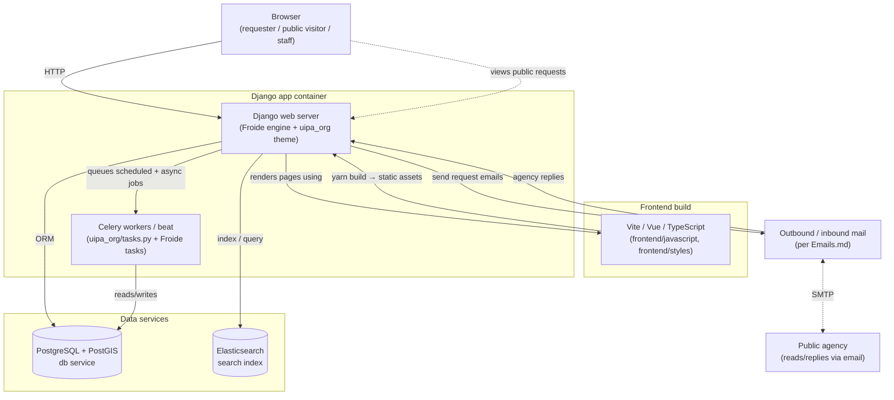
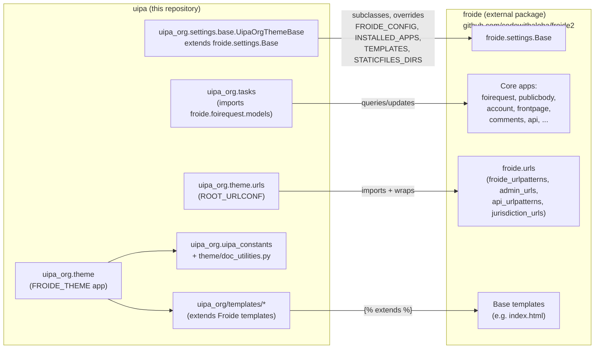
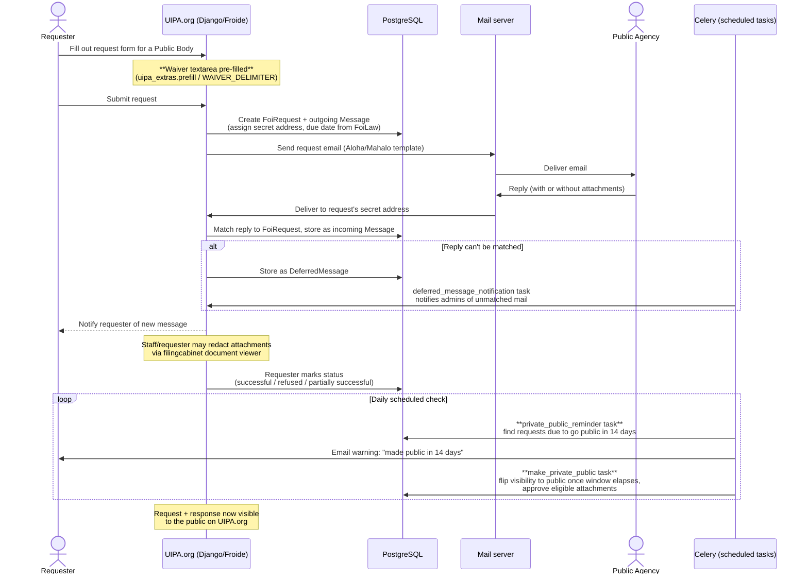

# Architecture

This page diagrams how UIPA.org is put together: the runtime services, how this repository relates to the Froide engine, and how a request flows from submission to publication. Pair this with [Features.md](Features.md) (what each piece does) and [Domain-Knowledge.md](Domain-Knowledge.md) (the vocabulary used below).

## System / container diagram

This shows the services that run when you follow [Getting Started](Getting-Started.md), whether via Docker Compose or run manually. Solid arrows are request/data flow; the Django app is the hub everything else talks to.



Notes:

- `docker-compose.yml` / `docker-compose.local.yml` define the `db` (PostgreSQL+PostGIS) and `elasticsearch` services; the `app` service (built from the `Dockerfile`) runs the Django server and, per `run-backend.sh`, can also run `yarn serve` for the frontend dev server and one-time DB init/seed steps controlled by the `INITIALIZE_DB` / `LOAD_DATA` / `DEBUG` env vars.
- In local (non-container) development, you run the same pieces yourself in separate terminals — see [Getting-Started.md](Getting-Started.md).
- Celery is wired up in the codebase (`uipa_org/tasks.py` imports a `uipa_org.celery` app) for scheduled jobs like the public-disclosure reminders described in [Features.md](Features.md); a message broker (e.g. Redis) is required for it to run, same as any Celery deployment.

## Engine vs. theme: how this repo relates to Froide

UIPA.org doesn't fork Froide — it depends on it as a package and plugs into its extension points. This is the same relationship described conceptually in [Domain-Knowledge.md](Domain-Knowledge.md#froide-the-engine-uipa-the-theme), shown here as code structure.



Key takeaway for new developers: **most business logic (what a `FoiRequest` is, how email matching works, how search works) lives in the `froide` package, not in this repo.** This repository mainly *configures* and *skins* that engine. When you're not sure where to look for something, check [Features.md](Features.md)'s table first.

## Request lifecycle (sequence diagram)

This traces a UIPA request from submission through to public disclosure, and shows where UIPA-specific logic (bold) plugs into the generic Froide flow.



## Repository layout

```
uipa/
├── uipa_org/                  # The "theme": UIPA/Hawaii-specific Django app
│   ├── settings/              # Extends froide.settings.Base
│   ├── theme/                 # FROIDE_THEME app: urls, views, templates, static, doc utilities
│   ├── templates/             # Site templates that  Froide's base templates
│   ├── fixtures/               # Seed fixtures (admin user, site config)
│   ├── uipa_constants.py      # Waiver/greeting/footer delimiter strings
│   └── tasks.py                # Celery tasks enforcing UIPA's public-disclosure rules
├── frontend/                   # TypeScript/Vue/SCSS entry points built by Vite
├── data/                       # Legacy CSV exports + seed/import scripts (see Seeding.md)
├── docs/                       # You are here
├── docker-compose*.yml, Dockerfile, run-*.sh  # Container orchestration
└── pyproject.toml, package.json                # Python (uv) and JS (yarn) dependencies,
                                                  # including the froide package itself
```

See [Development-Guide.md](Development-Guide.md) for a day-to-day tour of these directories.
